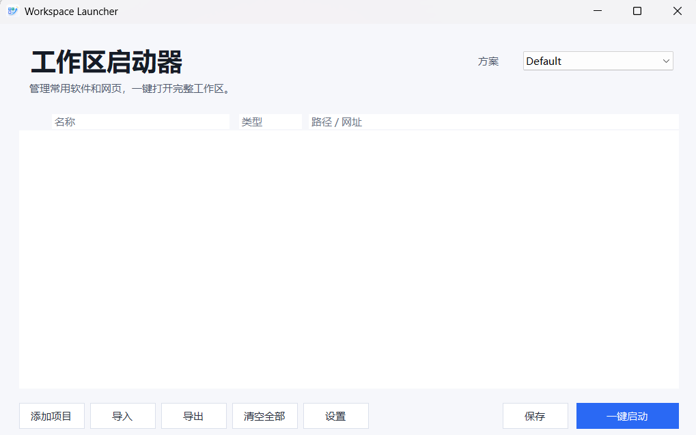

# Workspace Launcher

一个简洁的 Windows 桌面工作区启动器，用来管理多套常用软件和网页方案，并一键打开完整工作环境。

 


## 功能概览

- **一键启动工作区**：把常用网页、软件、Windows 命令或特殊启动入口放在同一个方案里，一次性打开。
- **多方案管理**：支持创建多个方案，例如“写作”“办公”“数据分析”“娱乐”等，每个方案有独立项目列表。
- **网页和软件统一管理**：一个“添加项目”入口，在弹窗中选择网页或软件。
- **自动识别名称和图标**：网页会识别标题和 favicon，软件会提取程序图标；识别不准时可以手动编辑名称和路径。
- **启用/停用项目**：临时不想启动某个项目时可以停用，不需要删除。
- **排序和右键菜单**：项目支持右键编辑、启用/停用、上移/下移、重新识别、复制路径、打开所在位置和删除。
- **导入/导出配置**：方便备份方案，或在另一台电脑上迁移配置。
- **启动前检查**：软件路径不存在、网址格式不正确时会提示；启动失败会统一汇总，不会连续弹出多个错误框。
- **设置项**：支持中英文界面、开机自启、启动成功后最小化或关闭启动器。
- **单实例运行**：重复打开 `WorkspaceLauncher.exe` 时，会唤起已经打开的窗口，而不是再开一个新窗口。
- **高 DPI 支持**：对 Windows 缩放比例做了基础适配，避免 125% 缩放下明显发糊。

## 适合的使用场景

- **论文/写作工作区**：一键打开 ChatGPT、Google Scholar、CNKI、EndNote、WPS 或 Word。
- **日常办公工作区**：一键打开邮箱、日历、网盘、Office、团队协作软件。
- **数据分析工作区**：一键打开代码编辑器、统计软件、文档、数据库管理工具和常用网页。
- **学习/课程工作区**：一键打开课程平台、笔记软件、浏览器资料页和词典工具。
- **个人娱乐工作区**：一键打开直播、音乐、聊天工具、游戏工具等。

## 快速开始

1. 下载或进入 `dist` 文件夹。
2. 双击运行 `WorkspaceLauncher.exe`。
3. 点击 **添加项目**。
4. 在弹窗里选择 **网页** 或 **软件**。
5. 填写路径或网址，保存。
6. 点击 **一键启动**。

首次运行时，程序会在 EXE 同目录自动创建：

```text
workspace-launcher.config.json
icons/
```

这些是本机运行数据，不建议提交到 GitHub。

## 添加项目说明

### 网页

网页项目填写网址即可，例如：

```text
https://chatgpt.com/
https://scholar.google.com/
https://www.cnki.net/
```

如果没有写 `https://`，程序会自动补上。

### 软件

软件项目可以填写 `.exe` 路径，例如：

```text
C:\Program Files\SomeApp\SomeApp.exe
```

也可以用浏览按钮选择程序。

### 启动参数

启动参数是传给软件的额外命令行选项，通常可以留空。  
网页项目不会使用启动参数。

例如启动 Microsoft Store / MSIX 应用时，可以用：

```text
路径: C:\Windows\explorer.exe
启动参数: shell:AppsFolder\OpenAI.Codex_2p2nqsd0c76g0!Codex
```

## 方案管理

右上角是当前方案下拉框。你可以：

- 展开下拉框后右键某个方案。
- 或在方案下拉框本身右键。

右键菜单包含：

1. 新建方案
2. 删除方案
3. 重命名方案

每个方案都有独立项目列表，切换方案时会自动保存当前列表。

## 设置

点击左下角 **设置** 可以调整：

- 界面语言：中文 / English
- 一键启动成功后最小化启动器
- 一键启动成功后关闭启动器
- 开机自启 Workspace Launcher

设置会保存到配置文件，下次打开仍然生效。

## 项目结构

```text
.
├─ assets/
│  ├─ WorkspaceLauncher.ico          # 应用图标，编译时嵌入 EXE
│  └─ WorkspaceLauncher.logo.png     # 图标源图
├─ dist/
│  └─ WorkspaceLauncher.exe          # 已编译好的可执行文件
├─ examples/
│  └─ workspace-launcher.config.example.json
├─ src/
│  └─ WorkspaceLauncher.cs           # 主程序源码
├─ build.ps1                         # 构建脚本
├─ .gitignore
└─ README.md
```

`legacy/` 是本地旧版本归档，默认被 `.gitignore` 排除，不需要上传。

## 从源码构建

要求：

- Windows
- .NET Framework 4.x SDK / Developer Pack，或系统中存在 `csc.exe`
- PowerShell

在项目根目录运行：

```powershell
.\build.ps1
```

构建完成后会生成：

```text
dist\WorkspaceLauncher.exe
```

手动编译命令大致如下：

```powershell
& "$env:WINDIR\Microsoft.NET\Framework64\v4.0.30319\csc.exe" `
  /target:winexe `
  /out:dist\WorkspaceLauncher.exe `
  /win32icon:assets\WorkspaceLauncher.ico `
  /reference:System.Windows.Forms.dll `
  /reference:System.Drawing.dll `
  /reference:System.Web.Extensions.dll `
  /reference:System.Web.dll `
  src\WorkspaceLauncher.cs
```

## 配置文件

运行时配置文件位于 EXE 同目录：

```text
workspace-launcher.config.json
```

配置中保存：

- 当前方案
- 所有方案
- 每个方案里的项目
- 软件/网页路径
- 启动参数
- 启用状态
- 图标缓存路径
- 设置项

示例配置见：

```text
examples\workspace-launcher.config.example.json
```

## 图标缓存说明

程序会把识别到的软件/网页小图标缓存到运行目录的 `icons` 文件夹。  
这样下次打开会更快，也不会每次都重新访问网页或重新提取软件图标。

`icons` 是本机运行缓存。

## 常见问题

### 资源管理器里 EXE 图标没有立刻变化

Windows 会缓存 EXE 图标。程序内部和任务栏通常已经更新，但资源管理器可能还显示旧图标。

可以尝试：

- 关闭正在运行的程序后刷新资源管理器。
- 取消固定任务栏图标，再重新固定。
- 注销或重启 Windows。

### 为什么我添加的软件不能启动？

常见原因：

- 路径不存在。
- 目标不是 `.exe` 或系统可识别的启动入口。
- 软件需要管理员权限。
- 启动参数填写错误。

可以右键项目，选择 **打开所在位置** 或 **重新识别** 来检查。

### 网页图标识别不准怎么办？

网页图标会优先尝试网站自己的 favicon，失败后回退到通用 favicon 服务。  
如果仍然不准，可以手动编辑项目名称；图标目前以自动识别为主。

## 技术说明

- 语言：C#
- UI：Windows Forms
- 目标平台：Windows
- 依赖：仅使用 .NET Framework 自带库
- 配置格式：JSON
- 图标格式：多尺寸 `.ico`
